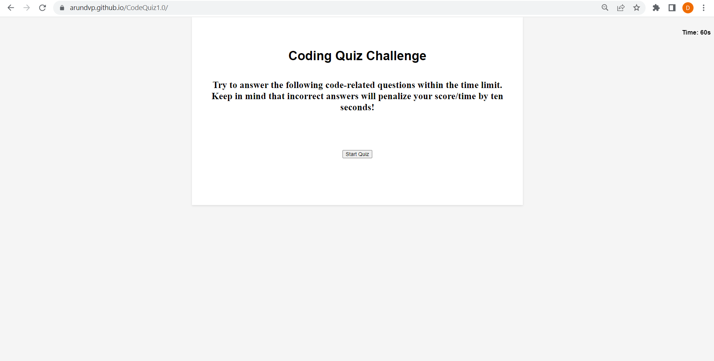

# CodeQuiz1.0
## Web APIs Challenge: Code Quiz

## Objective:

Build a timed coding quiz with multiple-choice questions. This app will run in the browser, and will feature dynamically updated HTML and CSS powered by JavaScript code. It will have a clean, polished, and responsive user interface.

## User Story: 

AS A coding boot camp student
I WANT to take a timed quiz on JavaScript fundamentals that stores high scores
SO THAT I can gauge my progress compared to my peers

## Summary of the Code 

1) Quiz Questions and Answers:

- The questions and answers are stored in an array called questions.
- Each question object contains the question, options, and the index of the correct answer.

2) Quiz Logic:

- The current `question` index, user's score, remaining time, and other variables are initialized.
- The `displayQuestion` function displays the current question and options on the page.
- The `checkAnswer` function checks the selected answer and provides feedback to the user.
- The `nextQuestion` function handles moving to the next question and updating the UI accordingly.
- The `displayScore` function displays the final score, allows the user to submit their initials, and provides navigation options.
- The `displayHighScores` function retrieves and displays the high scores from local storage, sorted in descending order.
- The `saveHighScore` function saves the user's high score with their initials to the highScores array.
- The `updateTimer` function updates the countdown timer on the page.
- The `startTimer` function initiates the countdown timer.
- Event listeners are added to the submit button and next button to trigger the quiz flow.

3) UI Styling:

The `displayQuestion` function adds CSS styles to the options list, including hover effects.

## Tasks Completed: 

Created the GIT repository named CodeQuiz1.0

Pushed the code the repository CodeQuiz1.0

Hosted the index.html in GitHub Pages

## Links

URL to the GitHub repository: https://github.com/arundvp/CodeQuiz1.0

URL to my deployed webpage: https://arundvp.github.io/CodeQuiz1.0/

